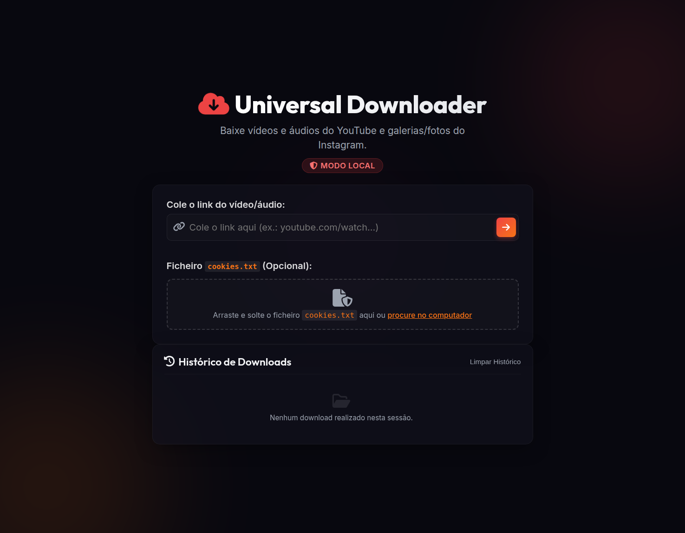

# UniversalDownloader

[](LICENSE)

> Local PHP/Apache media downloader for XAMPP, Laragon, WAMP, or another Apache + PHP 8.1+ stack.

UniversalDownloader is a local-first utility for retrieving video and audio from supported public URLs through `yt-dlp`. It presents metadata before download, supports MP4 and MP3 output, handles playlists, and keeps download history only in the browser.

## Demo



The interface is designed around a simple local workflow: paste a URL, inspect the media, choose the output format and save the resulting file. Cookies are optional and are accepted only when provided by the user for their own session.

> **Local-use notice:** This application is intended for personal use through Apache on a local machine. Do not expose it directly to the public Internet without a dedicated security review, authentication and an appropriate legal review of the content sources.

## Features

| Area | Supported behavior |
|---|---|
| Video | MP4 downloads with selectable quality when supported by the source |
| Audio | MP3 extraction with FFmpeg conversion |
| Sources | Supported public sources handled by the installed `yt-dlp` build, plus Instagram gallery support |
| Playlists | Start position, item limit, order selection and ZIP delivery |
| Metadata | Title, thumbnail, duration, uploader and available qualities before download |
| Privacy | Temporary request-specific files are removed after processing |
| History | Download history remains in browser `localStorage` and can be cleared |
| Cookies | Optional `cookies.txt`, limited in size and kept in temporary storage only |

## Installation on XAMPP for Windows

1. Extract the repository into `C:\xampp\htdocs\UniversalDownloader`.
2. Download the required runtime tools from their official sources and place them in the directories described in [`tools/README.md`](tools/README.md).
3. In `C:\xampp\php\php.ini`, enable `extension=zip`.
4. Confirm that `proc_open`, `proc_close`, `proc_get_status` and `proc_terminate` are not disabled.
5. Start or restart Apache from the XAMPP control panel.
6. Open `http://localhost/UniversalDownloader/` in your browser.

MySQL is not required. The temporary directory under `storage/tmp/` must be writable by Apache.

## Usage

Paste a public HTTP or HTTPS URL and select the arrow to retrieve its metadata. Choose **Video (MP4)** or **Audio (MP3)**, select the desired quality when applicable, and start the download. Playlist options become available when the source exposes multiple entries.

The browser history is local to the current browser and can be cleared from the interface. Uploaded cookies and generated files are stored in request-specific temporary directories and removed after the response is delivered.

## Security and limits

The application accepts only public HTTP/HTTPS URLs and rejects localhost, `.local` domains and private or reserved IP ranges. Command arguments are escaped individually, cookies are size-limited, processing has a timeout, and playlist requests have a maximum item count.

Direct HTTP access to `lib/`, `tools/` and `storage/` is blocked with `.htaccess` rules. Keep the application on `localhost`; do not forward router ports to this utility.

## Project structure

```text
UniversalDownloader/
├── api/                    # Metadata and download endpoints
├── assets/                 # CSS and browser-side JavaScript
├── lib/                    # yt-dlp and Instagram service classes
├── storage/tmp/            # Request-specific temporary files
├── tools/                  # Local runtime binaries, not committed
├── config.php
├── index.php
└── README.md
```

## License

The source code is released under the [MIT License](LICENSE). Runtime executables are third-party software and remain subject to their respective licenses.
